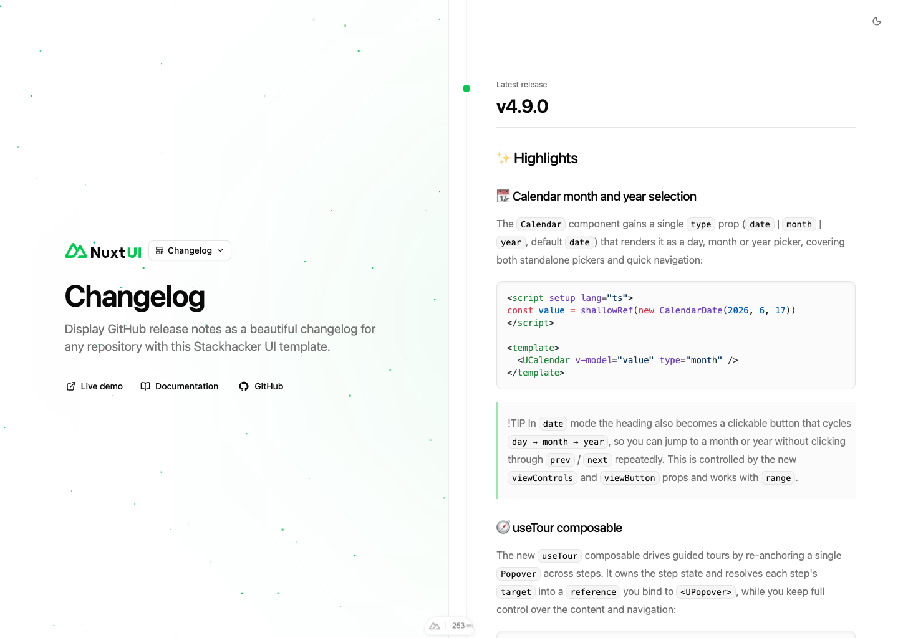

# Stackhacker UI Changelog Template

[](https://ui.stackhacker.io)

Use this template to display GitHub release notes as a changelog with [Stackhacker UI](https://ui.stackhacker.io), Nuxt MDC, and shadcn-vue components.

- [Live demo](https://changelog-template.stackhacker.io/)
- [Documentation](https://ui.stackhacker.io/docs/getting-started)

<a href="https://changelog-template.stackhacker.io/" target="_blank">
  <picture>
    <source media="(prefers-color-scheme: dark)" srcset="public/screenshots/changelog-dark.png">
    <source media="(prefers-color-scheme: light)" srcset="public/screenshots/changelog-light.png">
    
  </picture>
</a>

## Quick Start

```bash [Terminal]
pnpm dlx nuxi@latest init my-changelog -t gh:stackhacker-ui/changelog
cd my-changelog
pnpm install
pnpm dev
```

## Config

To customize the GitHub repository that the changelog fetches releases from, update the `repository` key in `app/app.config.ts`:

```ts [app/app.config.ts]
export default defineAppConfig({
  repository: "nuxt/ui", // Change this to your GitHub repository (e.g. "facebook/react")
});
```

Release notes are fetched from `https://ungh.cc/repos/<owner>/<repo>/releases` and rendered with Nuxt MDC. GitHub-flavored links in markdown are resolved for the configured default repository in `nuxt.config.ts` under `mdc.remarkPlugins.remark-github.options.repository`.

## Environment

No environment variables are required for the default changelog. The app reads public GitHub release data through ungh.

## Setup

Make sure to install the dependencies:

```bash
pnpm install
```

## Development Server

Start the development server on `http://localhost:3000`:

```bash
pnpm dev
```

To use another port:

```bash
pnpm dev --port 4000
```

## Production

Build the application for production:

```bash
pnpm build
```

Locally preview production build:

```bash
pnpm preview
```

Check out the [Nuxt deployment documentation](https://nuxt.com/docs/getting-started/deployment) for more information.

## Quality checks

```bash
pnpm lint
pnpm typecheck
pnpm build
```

## Renovate integration

Install [Renovate GitHub app](https://github.com/apps/renovate/installations/select_target) on your repository and you are good to go.
